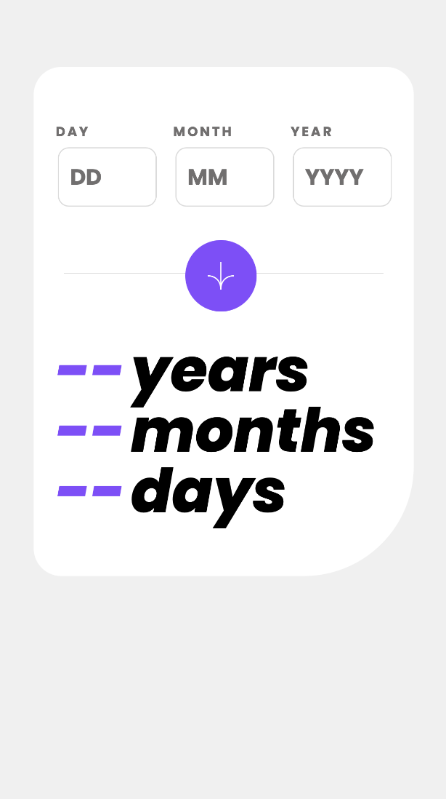
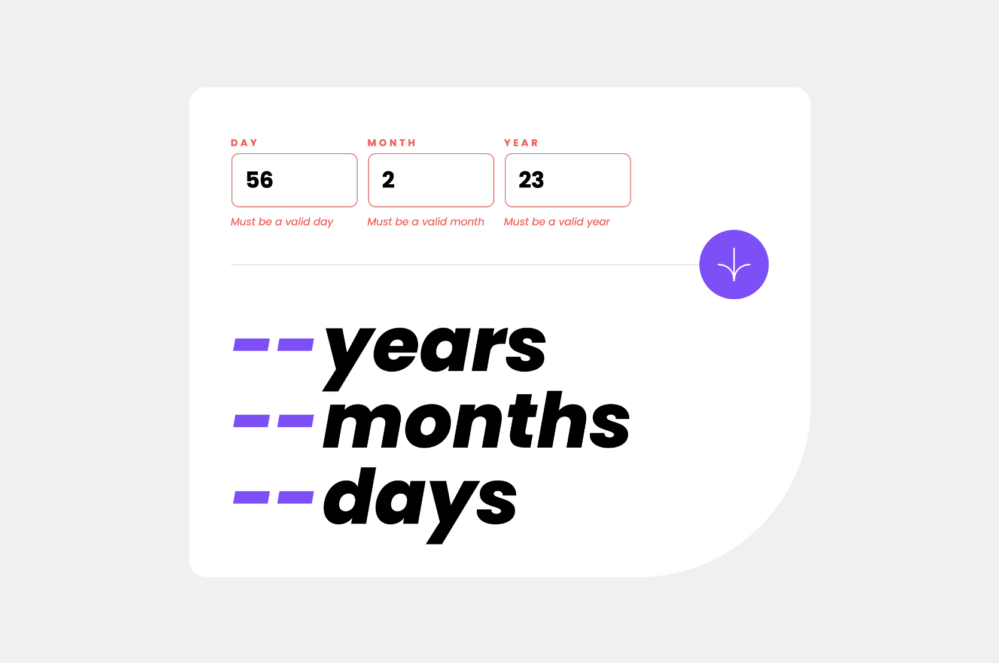

# Frontend Mentor - Age calculator app solution

This is a solution to the [Age calculator app challenge on Frontend Mentor](https://www.frontendmentor.io/challenges/age-calculator-app-dF9DFFpj-Q).

## Table of contents

- [Overview](#overview)
  - [The challenge](#the-challenge)
  - [Screenshot](#screenshot)
  - [Links](#links)
- [My process](#my-process)
  - [Built with](#built-with)
  - [What I learned](#what-i-learned)
  - [Useful resources](#useful-resources)
- [Author](#author)

## Overview

### The challenge

Users should be able to:

- View an age in years, months, and days after submitting a valid date through the form
- Receive validation errors if:
  - Any field is empty when the form is submitted
  - The day number is not between 1-31
  - The month number is not between 1-12
  - The year is in the future
  - The date is invalid e.g. 31/04/1991 (there are 30 days in April)
- View the optimal layout for the interface depending on their device's screen size
- See hover and focus states for all interactive elements on the page
- **Bonus**: See the age numbers animate to their final number when the form is submitted

### Screenshots

#### Mobile design



#### Desktop design


#### Active states


#### Form validations




### Links

- Solution URL: [Github](https://github.com/AdaGeorge/age-calculator)
- Live Site URL: [Netlify](https://agecalculator2023fm.netlify.app)

## My process

### Built with

- CSS
- Flexbox
- Mobile-first workflow
- [React](https://reactjs.org/) - JS library
- [Vite](https://vitejs.dev/guide/) - build tool
- [React Hook Form](https://www.react-hook-form.com) - Library - form Controller

### What I learned

In this project I did the form validation with react-hook-form and passed as props the controllers of the hook

```jsx
const Input = ({ register, label, required, ...otherProps }) => {
  return (
    <input
      type="text"
      placeholder={placeholder}
      {...register(label, {
        required,
        pattern: otherProps.pattern,
        max: otherProps.max,
      })}
      {...otherProps}
    />
  );
};

const Form = () => {
  const {
    required,
    handleSubmit,
    formState: { errors },
  } = useForm();
  return (
    <form>
      <Input
        placeholder={"DD"}
        label={"DAY"}
        register={register}
        required
        errors
        pattern={{
          value: DAY_REGEX,
          message: "Must be a valid day",
        }}
      />
    </form>
  );
};
```

I know this will lead to problems if the project scales.
I would like to do it with the 'Controller' hook and pass the component as the render property but I'm still figuring it out.

### Useful resources

- [Validate dates with javascript](https://medium.com/@LoretoVaquero/validar-fechas-con-javascript-fe1b1c7b6524) - This helped me so much to define how to do the validation of 'This day does not exist'
  The date is invalid e.g. 31/04/1991 (there are 30 days in April)

## Author

- Website - [Ada George](https://portfolio-react-tailwind.netlify.app)
- Frontend Mentor - [@AdaGeorge](https://www.frontendmentor.io/profile/AdaGeorge)
- Github - [Ada George](https://github.com/AdaGeorge)
